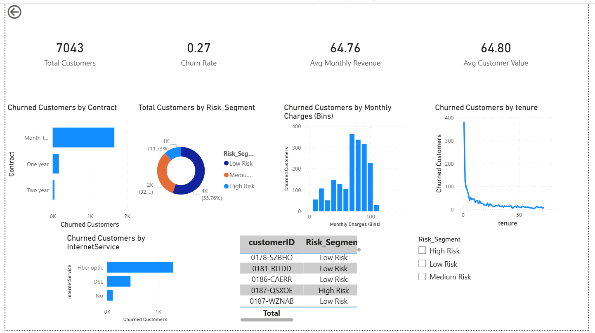

# 📊 Customer Churn Analysis

## 📌 Project Overview
This project analyzes customer churn behavior using SQL and Power BI. The goal is to identify key factors influencing churn and provide actionable insights for customer retention.

---

## 🛠️ Tools Used
- SQL (MySQL)
- Power BI
- Excel

---

## 📂 Dataset
- Telco Customer Churn Dataset (Kaggle)

---

## 🔧 Data Processing
- Cleaned raw data and handled missing values
- Created structured tables (customers, services, billing)
- Built a churn analysis table
- Engineered features like Risk Segment and Avg Customer Value

---

## 📊 Dashboard Features
- Churn Rate KPI
- Customer Segmentation (High/Medium/Low Risk)
- Churn by Contract Type
- Revenue & Tenure Analysis
- Interactive filters (slicers)

---

## 🔍 Key Insights
- High churn in month-to-month contracts
- Early tenure customers are more likely to churn
- High-paying customers show higher churn tendency

---

## 💡 Recommendations
- Target high-risk customers with offers
- Encourage long-term contracts
- Improve onboarding experience

---

## 📸 Dashboard Preview

